# FxHash Automation Software (2022-2023 DEPRECATED)
This is the compiled version for Windows with unobfuscated source code visible inside.

The main focus of this software is automation of the FxHash platform, but it has the ability to automate other platforms on Tezos blockchain as well.

This software enables users to manage their Tezos NFT portfolio, batch mint NFTs on FxHash, monitor secondary market actions, snipe and frontrun on underpriced items etc.

Some parts of the software certainly still do work, while others would need some tweaking in the code in order for them to work again.

This software started as a quick script in April 2022 and ended its journey exactly one year after. It has spent its last 6 months looking more or less the same - like you will see in the pictures. In those 6 months, 6 anonymous users (I only know their Discord usernames) used the software and made approximately 30k XTZ in profits with over 1k transactions and a bit less than 70k XTZ total volume.

Here is a visual overview of the software:

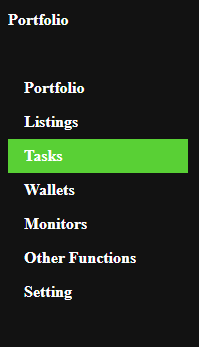
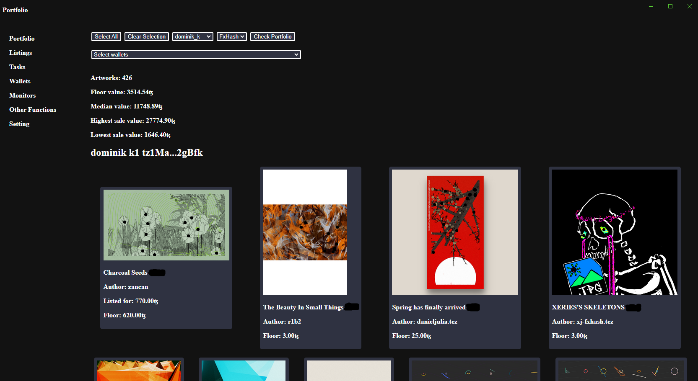
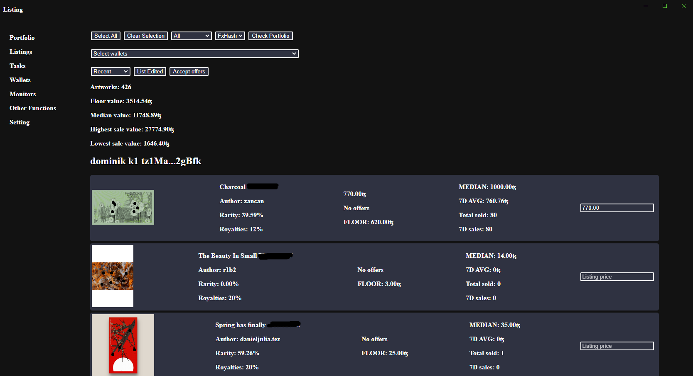
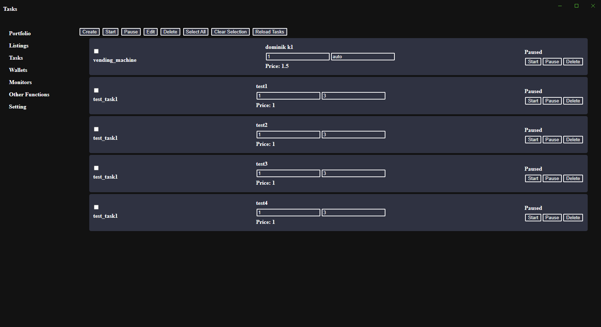
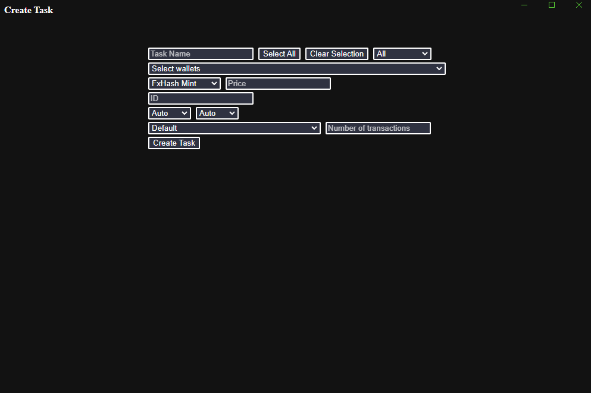
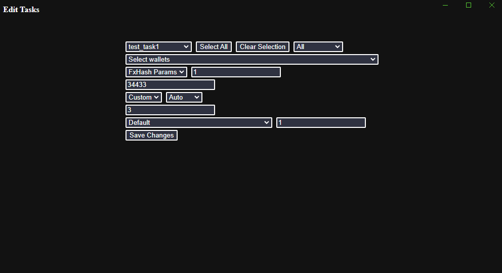
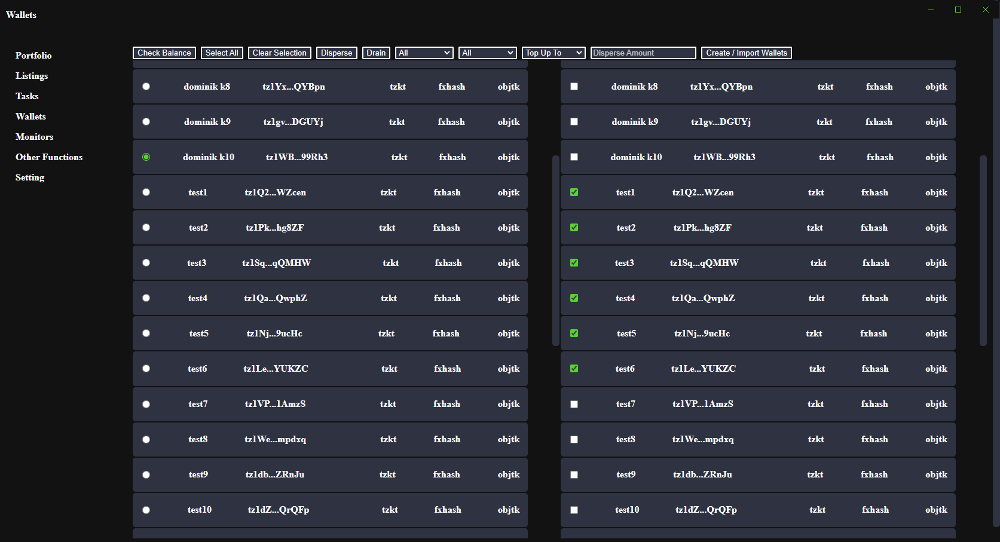
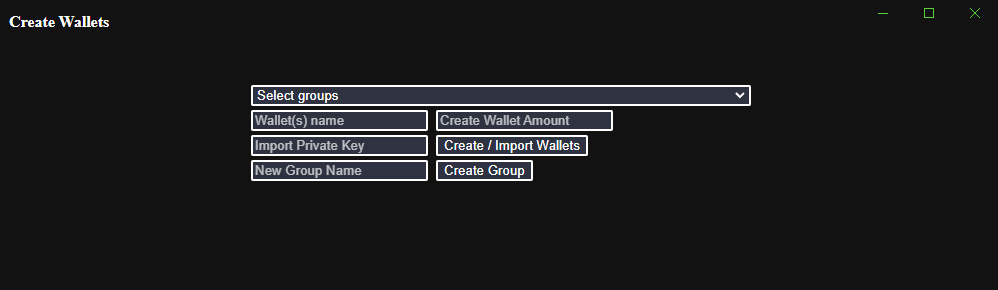

The majority of functionality under this section required a connection to the WebSocket service. In order not to create multiple connections, I created a simple WS splitter and broadcasted the events to a localhost port to which all the services are connected.
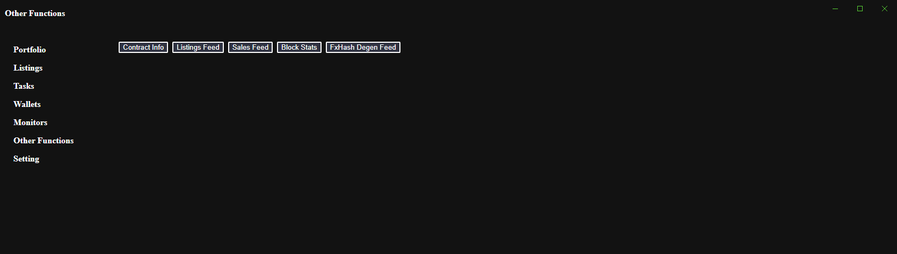
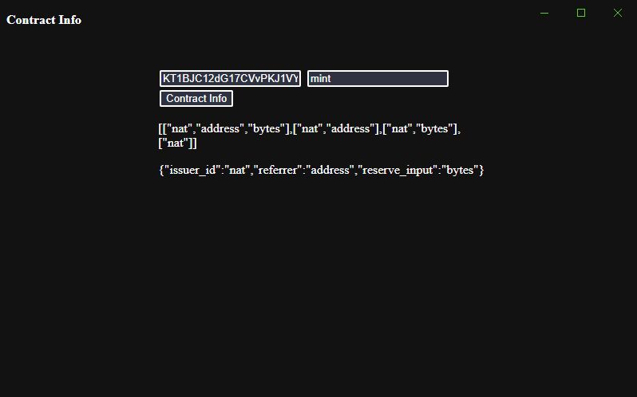
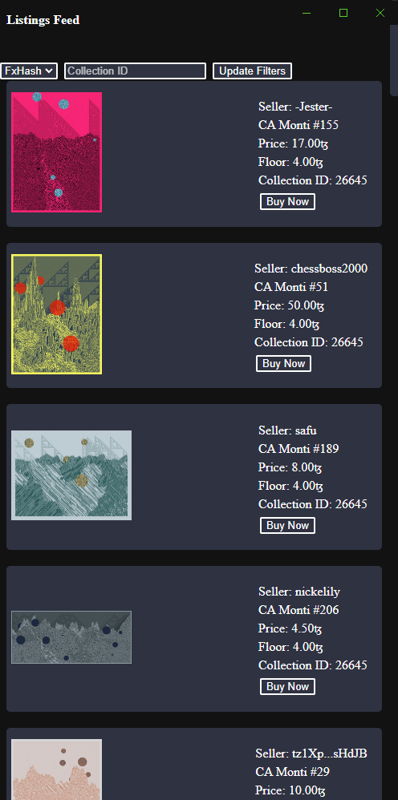
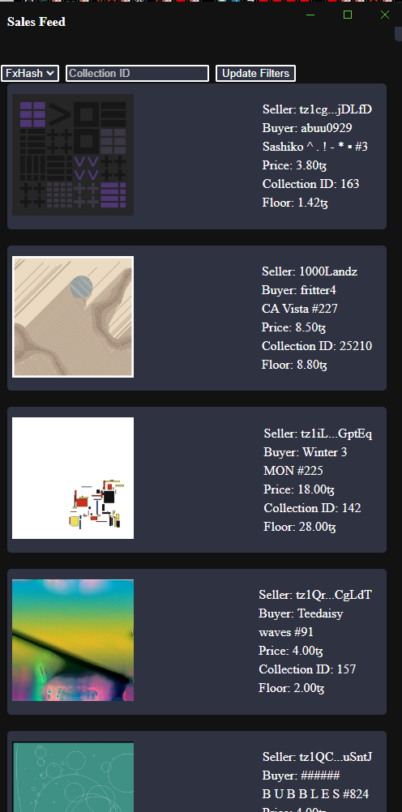
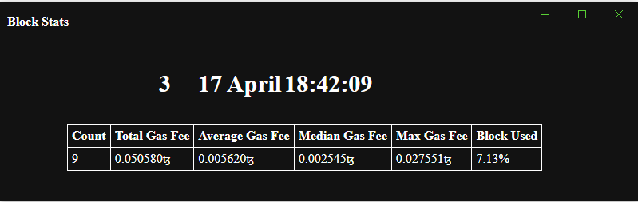
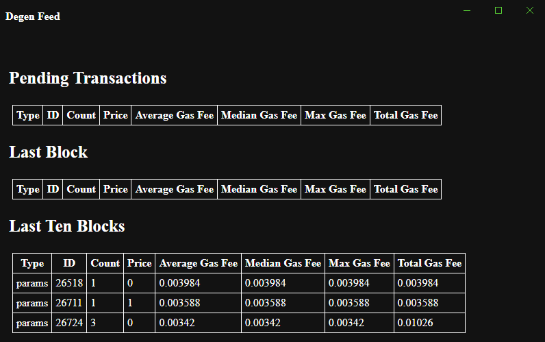

Software's settings
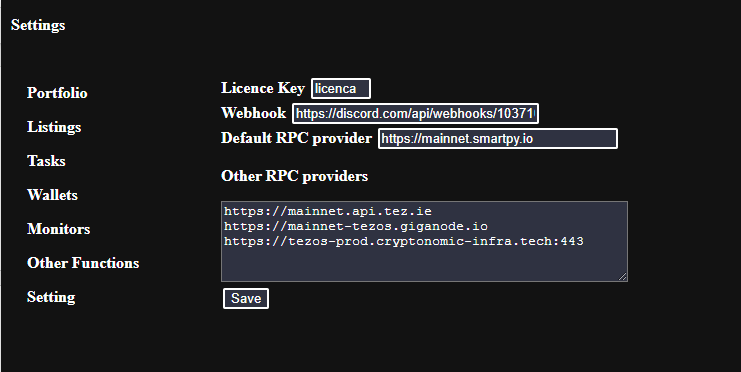

Discord Webhook example, when the bot has sucessfully minted an artpiece
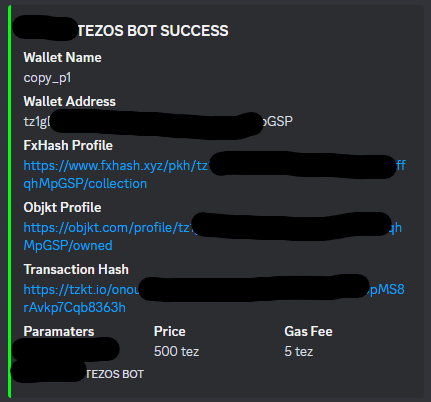